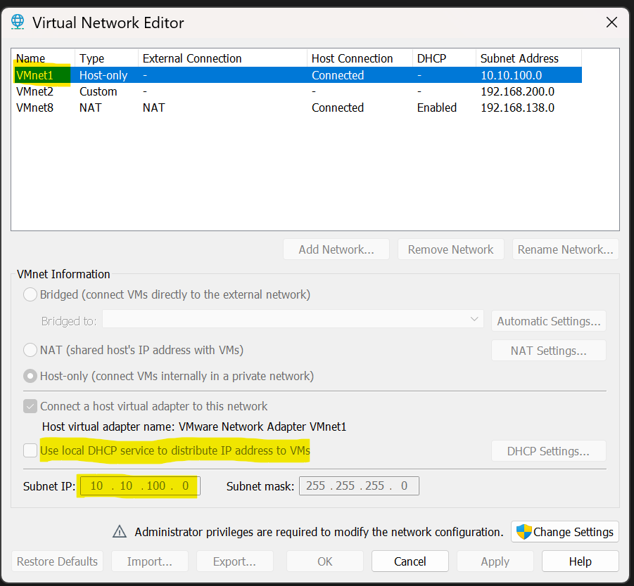
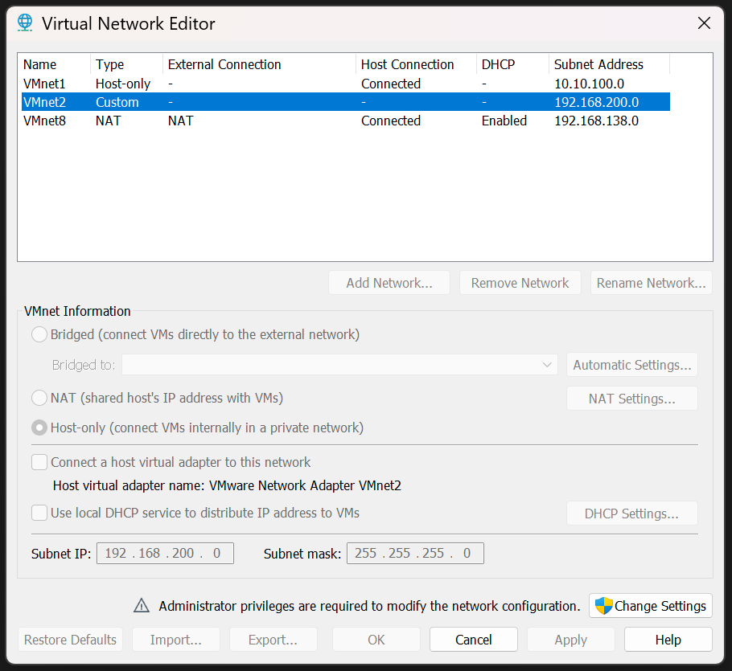
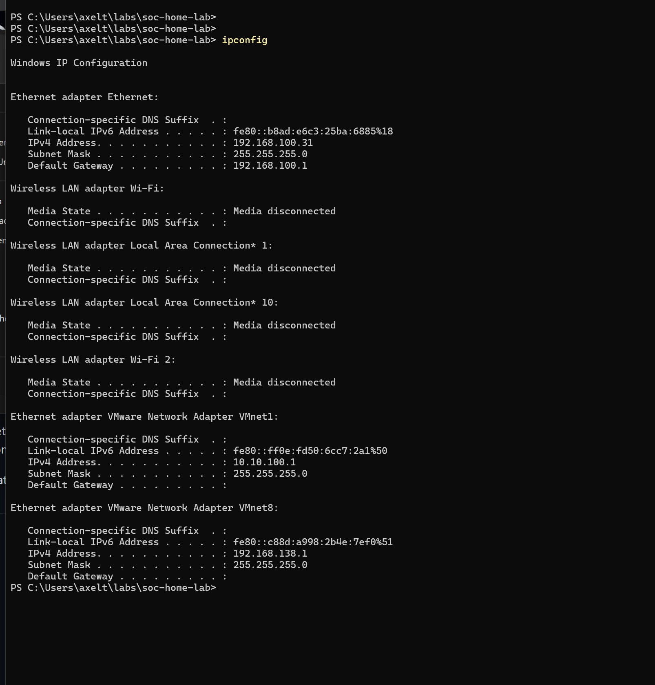
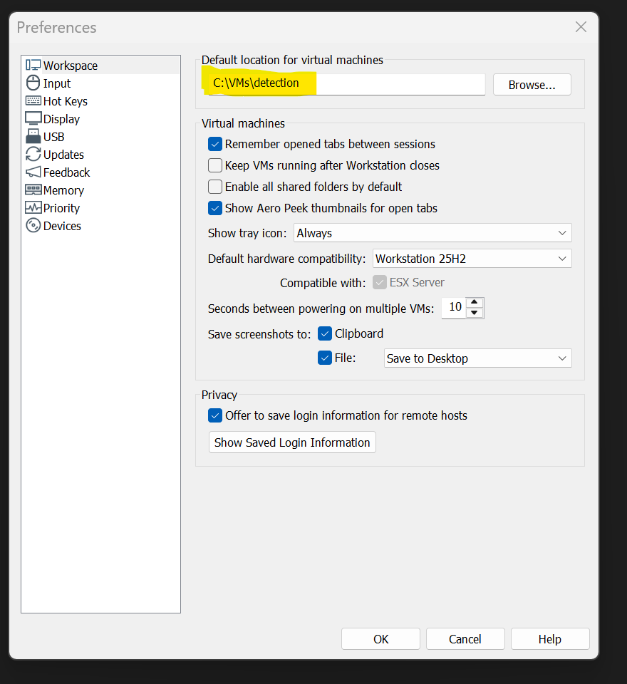

# 01 - Hypervisor and virtual networks

Date: 2026-09-20 · Repo: soc-home-lab

## Environment
- Host: Intel Core i9-13900K, 64 GB DDR5, NVIDIA RTX 3070, Windows 11 Pro (build 26100)
- Hypervisor: VMware Workstation Pro 25H2 (25.0.0.24995812), free personal-use license
- Backend: Windows still runs its own hypervisor (VBS status 2), so VMware is expected to use the Windows hypervisor backend. Performance is to be measured when the first VM boots (see Problem 1).

## What I built
1. Installed VMware Workstation Pro.
2. Set the default VM location to `C:\VMs\detection`, with shared folders disabled by default.
3. Created the storage layout on the NVMe and on the large HDD (see below).
4. Configured two isolated host-only networks: VMnet1 (detection lab) and VMnet2 (malware lab).
5. Created this repository and published this document.

## Storage layout

| Disk | Device | Type | Role | Reason |
|---|---|---|---|---|
| 3 | Samsung 980 PRO 2 TB | NVMe SSD | `C:\VMs\detection`, `C:\VMs\malware` (running VMs) | VM disk I/O is random and heavy, so the fastest disk holds the running VMs. |
| 1 | WD 8 TB | HDD | `D:\Lab\iso`, `D:\Lab\snapshots-archive`, `D:\Lab\sample-vault` | Installers, archived snapshots and malware samples are read rarely. |
| 2, 0 | WD 1 TB, Seagate 2 TB | HDD | Not used by the lab | Personal data. |

Rule: fast disk for running VMs, large disk for everything else. The sample vault is on a different physical disk from the running VMs. Samples stay as password-protected zips and are never extracted on the host.

Status: the `D:` folders were created, but see "Open issue" below.

## Network design

| Network | Type | Subnet | DHCP | Host adapter | Purpose |
|---|---|---|---|---|---|
| VMnet1 | Host-only | 10.10.100.0/24 | Off (static IPs) | Yes (10.10.100.1) | Detection lab: DC, SIEM, victims, attacker |
| VMnet2 | Host-only | 192.168.200.0/24 | Off | **No** | Malware analysis, fully isolated |
| VMnet8 | NAT | 192.168.138.0/24 (VMware default) | On (default) | Yes | Updates and installs only |

Why VMnet2 has no host adapter: a host adapter gives the host an IP address on that network, which is a path between the guest and the host's network stack. Without it, a sample running in the VM has no interface on the host to reach. DHCP is off so that nothing can join the network without a deliberate static address.

## Verification

**VMnet1 uses 10.10.100.0/24.**

**VMnet2 has DHCP disabled.**

**The host has an adapter on VMnet1 and VMnet8 only, and none on VMnet2.** The absence of a VMnet2 adapter is the proof that the host has no interface on the malware network.

**Default VM location is `C:\VMs\detection` and shared folders are disabled by default.**

## Problems encountered

### 1. Virtualization-based security (VBS) kept running

**Symptom:** `msinfo32` reported *Virtualization-based security: Running* and *A hypervisor has been detected*. VMware Workstation is slower when Windows keeps its own hypervisor active.

**Evidence collected:**
- `hypervisorlaunchtype` was `Off` after the first `bcdedit` change.
- `Win32_DeviceGuard`: `VirtualizationBasedSecurityStatus = 2` (running), with no services configured or running (`{0}`), so Memory Integrity and Credential Guard were not the cause.
- The `VirtualMachinePlatform` feature was enabled, and WSL was on version 2.
- The registry value `EnableVirtualizationBasedSecurity` was `1`.
- The PC was not domain-joined, not Azure AD-joined, and had no MDM URL, so no company policy was enforcing VBS.
- Docker was not installed.

**Actions:**
1. `bcdedit /set hypervisorlaunchtype off`
2. Disabled the Virtual Machine Platform feature.
3. Set the DeviceGuard registry values and the Group Policy value to `0`.
4. Restarted and re-checked after each change.

**Result:** disabling Virtual Machine Platform removed my `hypervisorlaunchtype off` entry from the boot configuration, so I re-applied it. After that, `hypervisorlaunchtype = Off`, policy `EnableVirtualizationBasedSecurity = 0`, and HVCI `Enabled = 0`, `Locked = 0` were all verified. VBS status was still `2`. Smart App Control reads as enabled (`VerifiedAndReputablePolicyState = 1`). I did not prove that it is related to VBS, and I did not turn it off, because turning it off is permanent until Windows is reinstalled.

**Decision:** timeboxed at three attempts. I continue with VMware and will judge performance when the first VM is built.

### 2. Lab subnet overlapped my home network

**Symptom:** `ipconfig` showed my physical Ethernet adapter at `192.168.100.31` with gateway `192.168.100.1`, and the VMnet1 host adapter also at `192.168.100.1`.

**Cause:** I chose `192.168.100.0/24` for the lab without checking my real network first. Two interfaces in one subnet, one of them holding the router's address, can send traffic to the wrong interface.

**Fix:** changed VMnet1 to `10.10.100.0/24`. No VMs existed yet, so nothing had to be rebuilt.

### 3. Git repository created in the wrong folder

**Cause:** the target folder did not exist, so `cd` failed and PowerShell stayed in `C:\Windows\System32`. `git init` and `mkdir` then ran there.

**Fix:** deleted the `.git` folder and the empty `docs` folders, and confirmed with `Test-Path`.

### 4. First `git push` failed

**Cause:** the repository had no commits (the files had not been created yet), and the remote URL contained the literal placeholder `<your-username>`.

**Fix:** created the files, committed, and corrected the URL with `git remote set-url`.

### 5. Commit that changed nothing

**Cause:** I ran `git commit` on files I had not staged, and later made a commit whose message said "fix" while the document was unchanged. I also had screenshot filenames with spaces that would break Markdown image links.

**Fix:** stage first (`git add`), read `git status` before committing, use hyphenated filenames, and write commit messages that describe what changed.

## Storage incident: two drives dropped (mitigated, monitoring)

**Timeline (System event log, 2026-09-20):**
- 3:22:44 PM — `storahci` event 129: reset issued to `\Device\RaidPort1` (twice)
- 3:22:45 PM — `disk` event 157: Disk 1 (WD 8 TB) and Disk 2 (WD 1 TB) surprise removed
- 4:18 PM — next boot; both drives detected again

**Scope:** only the two WD drives dropped. The Seagate HDD and the NVMe were unaffected, which
points at something the two WD drives share: their SATA controller, link power management,
or power lead.

**Evidence after recovery:** SMART shows 0 read errors on all HDDs. No further 129/157 events.

**Root cause:** not determined.

**Mitigation (2026-09-26):** AHCI Link Power Management set to Active; disk spin-down disabled.

**Monitoring:** weekly event log check, filtered by provider and ID:
`Get-WinEvent -FilterHashtable @{LogName='System'; ProviderName='storahci','disk'; Id=129,157; StartTime=(Get-Date).AddDays(-7)}`.
The malware sample vault stays unused until two weeks pass with no events. If they recur,
the connectors will be reseated.